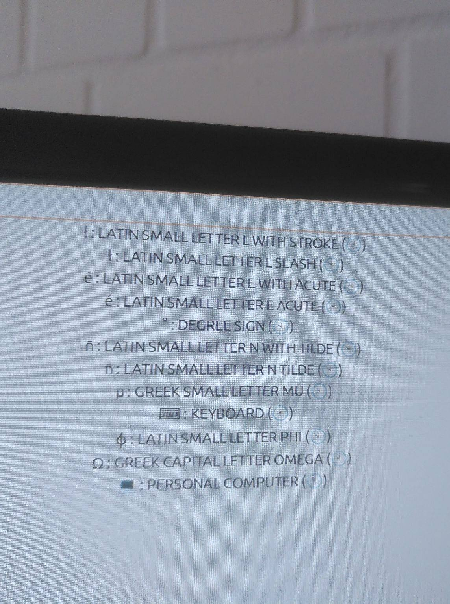

# Stress Free Unicode

Until recently, every time I had to write café, or 10°C, or El Niño, or
jalapeño, or 220Ω, 100μsec, or Paweł, or π, I felt slightly stressed, and
usually went to wikipedia or something to copy and paste the symbol I needed.

I don't use any of these symbols enough to memorize one of those keycodes, or
combinations, or remap my keyboard, but I use all of them enough to need a
solution.

What I came up with is inspired by how I felt the first time I saw the
Windows Vista start menu, and being able to just type in what I wanted - instead
of whatever we did before.

### What I do now

Now if I need a symbol, I press `F9` and I just type in the name of the symbol
I want, or select it from my recently use symbols using the mouse or arrow keys.



<small>
	sorry I couldn't figure out how to take a screenshot of it. the menu closes
	as soon as I press the button
</small>


It's just a dropdown that covers your whole screen, and lets you search all the
unicode symbols, and puts your recent selections at the top.

### Technical stuff

I just layed out this repo in the `.deb` format so make packaging easier to get
it onto all my computers. So everything interesting is
[here](package/usr/share/symbol-selector/)

It gets the list of symbols from emacs, so you have to have emacs
installed to use it. In emacs you can insert a symbol by name with `C-x 8 RET`.

I still use the built-in emacs way when using emacs since xdotool seems to have
trouble inserting certain characters into emacs. Try this and tell me if you
have the same issue:

```
sleep 5 && xdotool type 'é°'
# and then switch over to an emacs buffer before the timer runs out
```

When I do that the `°` works fine but the `é` doesn't, and the order doesn't
matter.

I use it in Gnome3 and MATE.  They both work most of the time. `xdotool` is a
bit fiddly sometimes outside of emacs, but it is good enough to improve my
symbol selecting experience. I don't know if it works on Wayland.

### Installation

Two ways to install it are:
* download the .deb file from the build and install it. They point a shortcut
at `python3 /usr/share/symbol-selector/main.py`. I used F9.
* clone the repo and point a keyboard shortcut at
`python3 /path/to/symbol-selector/package/usr/share/symbol-selector/main.py`.
You might have to figure out some dependencies.
I point Shift-F9 at that one so that I have one shortcut to the "LTS" version
and another shortcut to the version I am working on improving.

If you are going for the second option, I recommend reading through the source
code first, and making sure it's nothing dodgy. If you are going for the
former option, I think you should read through github actions and make sure
you are comfortable with what is in the package. Or you might just want to
steel the idea and make your own.  Or if there is already a much more practical
way to accomplish this, please let me know because I couldn't find anything.

##### One more thing

Even in emacs and tmux, I don't memorize key combinations unless it is something
I do all the time. I am happy typing in `:break-pane`, or `M-x eval-region`,
even `M-x magit-status`. It don't start to configure key combinations until I
am really annoyed by a single command. So extending this attitude to characters
is natural for me.
